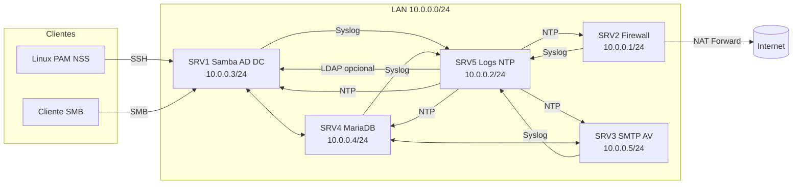

# Diagrama de Arquitetura (Rede Interna)

Rede interna usada: **enp0s8 – 10.0.0.0/24**  
(Endereçamento externo/publico foi ignorado por decisão do projeto)

## Nós

- **SRV1 (10.0.0.3)** — LDAP / Samba / Active Directory
- **SRV2 (10.0.0.1)** — Firewall / Netfilter (Gateway)
- **SRV3 (10.0.0.5)** — SMTP + Antivírus
- **SRV4 (10.0.0.4)** — Banco de Dados
- **SRV5 (10.0.0.2)** — Logs e NTP

## Diagrama (Mermaid)

